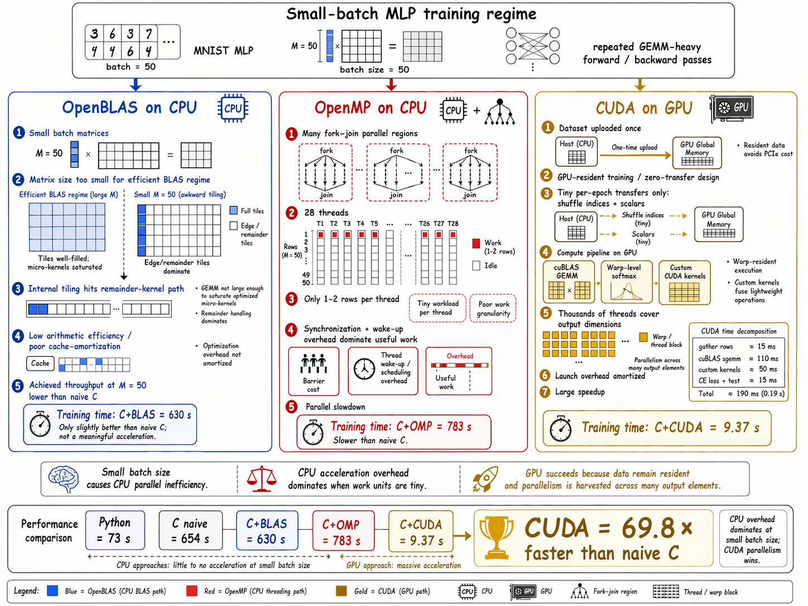

# 🚀 From NumPy to CUDA: Implementing and Accelerating an MLP for MNIST Classification in C

从零开始用纯 C 实现高效的 784-512-10 多层感知机，系统对比多种加速后端在 MNIST 上的性能差异。

---

## 📊 核心性能指标

**完全相同的训练配置**：50 epoch，batch=50，lr=0.09，seed=42

| 实现 | 总时间 | 每 epoch | 测试精度 | vs Naive C |
|------|-------:|--------:|--------:|-----------:|
| Python (numpy fp64) | 73 s | 1.5 s | 98.37% | 9.0× |
| **C Naive (fp64)** | **654 s** | **13.1 s** | **98.24%** | **1.0×** |
| C + OpenBLAS (fp64) | 630 s | 12.6 s | 98.24% | 1.04× |
| C + OpenMP 28 线程 (fp64) | 783 s | 15.7 s | 98.24% | 0.83× |
| **C + CUDA (RTX 5060 Ti, fp32)** | **9.37 s** | **0.19 s** | **98.25%** | **69.8×** |

### ✅ 数值精度验证

| 对齐测试 | 覆盖张量 | 最大误差 |
|---------|---------|---------|
| C naive vs Python (fp64) | 所有 8 个前向/反向张量 | < 1e-14 |
| CUDA vs Python (fp32 vs fp64) | 所有 8 个前向/反向张量 | < 4e-7 |

### 🔍 关键发现

1. **小 batch 下 OpenBLAS 的悖论**  
   M=50 时 OpenBLAS 反而比朴素 C 慢。原因：BLAS 触发 remainder-kernel 慢路径，而 naive C 被编译器 SIMD 自动向量化已达 8.6 GFLOP/s。

2. **OpenMP 在小 batch 下失效**  
   每 epoch 12000 次线程 fork/join 同步开销 (~75μs/次) 吃掉了并行收益，导致性能反而下降 17%。

3. **CUDA 突破小 batch 瓶颈** 🎯  
   GPU 常驻 warp 模型无线程启动开销，并行度来自 M×N 维，M=50 也能打满硬件——这是 BLAS/OMP 无法做到的。

---

## 📈 性能对比可视化

### Baseline 性能基准（Python 优化参考）


### 多后端加速对比



---

## 📁 项目结构

```
mnist-mlp-c/
├── python/                      # Python 基线 + 权重导出
│   ├── prepare_data.py          #   IDX 文件读取
│   ├── train.py                 #   训练主程序（98.37%）
│   ├── export_weights.py        #   导出 init/trained 权重 + batch0 中间结果
│   ├── export_shuffle.py        #   导出前 5 epoch 的 shuffle 顺序
│   └── npy_to_bin.py            #   .npy → 裸 fp64 二进制（供 C 读取）
│
├── src/                         # C 通用代码 + 朴素 GEMM
│   ├── matrix.{c,h}             #   Matrix 结构 + 非 GEMM 操作
│   ├── matrix_gemm.c            #   朴素三重循环 GEMM（OMP 感知）
│   ├── activation.{c,h}         #   ReLU / 稳定 Softmax / CE loss
│   ├── nn.{c,h}                 #   forward / backward / SGD update
│   ├── data.{c,h}               #   IDX 二进制解析 + 归一化 + one-hot
│   ├── rng.{c,h}                #   MT19937 + Box-Muller + Fisher-Yates
│   └── train.c                  #   训练主程序
│
├── blas/                        # OpenBLAS 后端（替换 GEMM）
│   └── matrix_blas.c            #   cblas_dgemm 实现三种 GEMM
│
├── cuda/                        # CUDA FP32 后端（GPU-resident）
│   ├── cuda_utils.h             #   错误检查宏
│   ├── kernels.{cuh,cu}         #   ReLU / Softmax / bias / col_sum / axpy 等 9 个 kernel
│   ├── nn_cuda.{cuh,cu}         #   cuBLAS sgemm + forward/backward/update
│   ├── train_cuda.cu            #   GPU 常驻训练主程序
│   └── test_alignment_cuda.cu   #   FP32 vs FP64 对齐测试
│
��── tests/                       # 数值对齐测试
│   ├── test_alignment.c         #   单 batch 前向/反向逐元素对比
│   ├── test_train_alignment.c   #   5 epoch 训练端到端对比
│   └── bench_gemm.c             #   GEMM 微基准（不同 M 形状）
│
├── data/                        # MNIST IDX 文件（需用户下载，见下方）
├── weights/                     # 训练中间产物（Python 导出 + C/CUDA 输出）
├── logs/                        # 训练日志 + 分析报告
│   ├── phase2_analysis.md       #   C 实现的数学推导与代码细节
│   └── phase3_analysis.md       #   CPU/GPU 加速 benchmark 分析
│
├── Makefile                     # 构建所有目标
└── benchmark.sh                 # 端到端对比脚本（Python vs Naive vs BLAS）
```

---

## 🛠️ 环境要求

| 组件 | 版本 / 备注 |
|------|-----------|
| OS | Linux / WSL2 |
| GCC | ≥ 9 （C11 + `-march=native`） |
| Make | 任意 GNU make |
| Conda | Anaconda / Miniconda（用于 Python + OpenBLAS） |
| Python | 3.11 + numpy |
| OpenBLAS | 0.3.x（随 conda 环境安装） |
| CUDA（可选） | 12.8 + nvcc，NVIDIA GPU（compute capability ≥ 5.0） |

**开发环境**：Intel i7-14700KF (28 逻辑核) + NVIDIA RTX 5060 Ti (16GB, sm_120)

---

## 🚀 快速开始：完整指令

### 步骤 0 — 克隆仓库

```bash
git clone <your-repo-url> mnist-mlp-c
cd mnist-mlp-c
```

### 步骤 1 — 下载 MNIST 数据

从 [MNIST Database](http://yann.lecun.com/exdb/mnist/) 下载以下 4 个文件到 `data/` 目录：

```
data/
├── train-images-idx3-ubyte
├── train-labels-idx1-ubyte
├── t10k-images-idx3-ubyte
└── t10k-labels-idx1-ubyte
```

若下载的是 `.gz` 压缩包，记得解压：
```bash
gunzip data/*.gz
```

### 步骤 2 — 创建 Conda 环境

```bash
conda create -n mnist-mlp python=3.11 numpy openblas -c conda-forge -y
conda activate mnist-mlp
```

> 💡 OpenBLAS 头文件和动态库会安装到 `$CONDA_PREFIX/{include,lib}`。若路径与 Makefile 第 6 行不符，请自行修改。

### 步骤 3 — Phase 1：Python 基线

```bash
python python/prepare_data.py       # 验证 IDX 数据加载
python python/train.py              # 50 epoch 训练，约 73s，期望精度 98.37%
python python/export_weights.py     # 导出 init/trained 权重和 batch0 中间结果 (.npy)
python python/export_shuffle.py     # 导出前 5 epoch shuffle 索引
python python/npy_to_bin.py         # .npy → .bin（C 端直接 fread）
```

### 步骤 4 — Phase 2：C 实现（CPU 基线）

```bash
make all                            # 构建所有 CPU 目标

./test_alignment                    # 单 batch 对齐验证：vs Python 逐元素 max_err < 1e-14
./test_train_alignment              # 5 epoch 对齐验证：loss 相对误差 < 0.0004%
./train_mnist                       # 朴素 C 训练 50 epoch，约 654s，期望精度 98.24%
```

### 步骤 5 — Phase 3：CPU 加速（OpenBLAS + OpenMP）

```bash
./train_mnist_blas                  # OpenBLAS 后端，约 630s（小 batch 无显著加速）
./train_mnist_omp                   # OpenMP 28 线程，约 783s（演示小 batch 瓶颈）

./bench_gemm                        # GEMM 微基准（不同 M 形状）
./bench_gemm_blas
./bench_gemm_omp
```

观察三者在 M=50 / M=500 / M=5000 上的 GFLOP/s — 小矩阵 BLAS 甚至慢于 naive。

### 步骤 6 — Phase 3.5：CUDA 加速（可选，需 NVIDIA GPU）

```bash
make cuda                           # 使用 nvcc 构建 CUDA 目标

./test_alignment_cuda               # FP32 vs FP64 对齐验证：max_err < 4e-7
./train_mnist_cuda                  # GPU 训练 50 epoch，约 9.4s，期望精度 98.25%
```

### 步骤 7 — 一键端到端对比

```bash
./benchmark.sh                      # Python + Naive C + OpenBLAS 全跑一遍
                                    # 结果汇总至 logs/benchmark_results.txt
```

---

## 🎯 构建目标速查

### 快速构建命令

```bash
make              # = make all — 构建所有 CPU 目标
make cuda         # 构建 CUDA 目标
make clean        # 清理所有二进制和 .o 文件
```

### 可执行文件详表

| 目标 | 说明 | 后端 |
|------|------|------|
| `train_mnist` | 训练可执行文件 | naive C |
| `train_mnist_omp` | 同上 + 多线程 | naive C + OpenMP |
| `train_mnist_blas` | 同上 + BLAS | OpenBLAS dgemm |
| `train_mnist_cuda` | 同上 + GPU | CUDA + cuBLAS sgemm |
| `test_alignment` | 单 batch 数值对齐 | naive C |
| `test_train_alignment` | 5 epoch 端到端对齐 | naive C |
| `test_alignment_cuda` | CUDA vs Python 对齐 | CUDA |
| `bench_gemm{,_blas,_omp}` | GEMM 微基准 | 三种后端 |

### 加载预训练权重

每个训练程序支持 `--load-init` 参数，用于加载 Python 导出的初始权重（强对齐验证而非随机初始化）：

```bash
./train_mnist --load-init
./train_mnist_cuda --load-init
```

---

## 📦 输出文件说明

训练产生的文件及位置：

| 路径 | 内容 |
|------|------|
| `weights/W{1,2}.bin`, `b{1,2}.bin` | Python 训练完的权重（fp64） |
| `weights/init_W{1,2}.bin`, `init_b{1,2}.bin` | Python 初始化权重（用于对齐验证） |
| `weights/c_W{1,2}.bin`, `c_b{1,2}.bin` | C naive/OMP/BLAS 训练权重 |
| `weights/cuda_W{1,2}.bin`, `cuda_b{1,2}.bin` | CUDA 训练权重（已转为 fp64 便于兼容） |
| `logs/batch0_*.bin` | Python 第一个 batch 的 X, Y 及 8 个前向/反向中间张量 |
| `logs/shuffle_ep{1..5}.bin` | 前 5 epoch 的 shuffle 索引（int32） |
| `logs/train_log.csv` | Python 训练日志 |
| `logs/train_log_c.csv` | C CPU 训练日志 |
| `logs/train_log_cuda.csv` | CUDA 训练日志 |

---

## 📚 深度分析

详细的数学推导、代码细节和性能根因分析见：

- **[logs/phase2_analysis.md](logs/phase2_analysis.md)** — C 实现的完整推导与代码走查
- **[logs/phase3_analysis.md](logs/phase3_analysis.md)** — CPU/GPU 加速 benchmark 与根因诊断

---

## 📜 许可证

This project is licensed under the MIT License - see the LICENSE file for details.

---

## 📖 参考资料

- [MNIST Database](http://yann.lecun.com/exdb/mnist/) — LeCun et al.
- [nipunmanral/MLP-Training-For-MNIST-Classification](https://github.com/nipunmanral/MLP-Training-For-MNIST-Classification) — Python numpy 原始实现参考
- He et al., [*Delving Deep into Rectifiers*](https://arxiv.org/abs/1502.01852), 2015 — He 初始化
- Matsumoto & Nishimura, [*Mersenne Twister*](https://doi.org/10.1145/272991.272995), 1998 — MT19937
